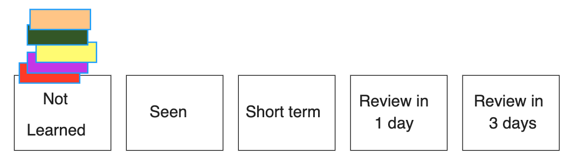
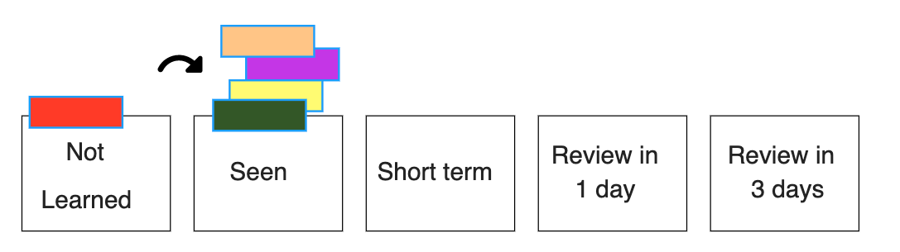
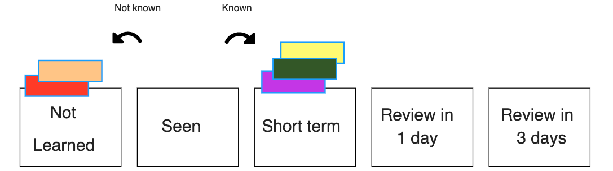
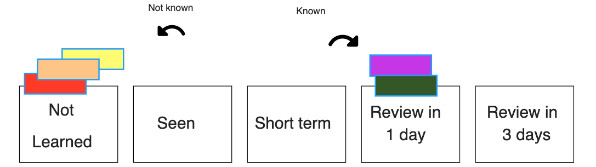
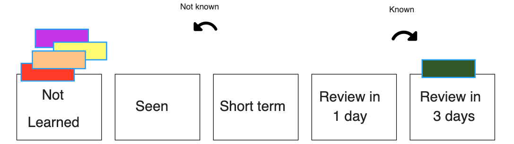
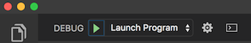

# Flashy: A teacher-focused flash card app

## Description

_Duration: Two Weeks Challenge_

Flashy is a teacher-focused flash card app intended for language study. Teachers assign stacks of flash cards to students and are then able to track each student’s progress and participation rate. Teachers can upload CSV files of cards (with front, back, and optionally a batch number in the CSV file) instead of typing out all the cards in the app. (Although that is an option too, along with editing any cards that were already created). The app makes use of Unicode and supports right-to-left text, so languages like Hebrew will display correctly on the digital cards.

Students receive feedback on their progress and reminders when they need to review cards. Cards get sorted based on the student’s familiarity with each card; once cards are marked “known” they will be reviewed periodically, but at intervals increasing in length. (For instance, cards get reviewed after 1 day, then 3 days, then 7 days, etc.).

Teachers are expected to interact with this application on desktop, while students are mostly expected to interact with the application on mobile.

A deployed version of the app can be found [here](https://shrouded-bayou-74485.herokuapp.com/).

The scope document for this project, in Google Docs format, is available [here](https://docs.google.com/document/d/1qhgVAW9iBsIN5H6W28pClkwe0-kvPkaiO67Ugk0Gow4/edit?usp=sharing).

### Pedagogical notes

At the core of this app is a [spaced repetition flash card management system (based on the Leitner system)](https://en.wikipedia.org/wiki/Flashcard#Spaced_repetition) that can also be utilized using real cards. The app tracks these cards for the student, significantly reducing the management load and barrier to entry. The following introduction provides a visual representation and explanation of how this management process functions.

The student has a stack of cards, each containing a front (containing, e.g., a word) and back (containing a translation of the given word) and several boxes (or piles) labeled “not learned, seen, short term, review in 1 day, review in 3 days, review in n days.” At the start, all of the cards are in the “not learned” box:

The student then proceeds to review several cards by looking at the back and the front. The student places those cards in a “seen” pile:

Immediately after, the student reviews all of those cards, deciding whether they are “known” or not. Cards that are known are moved to the “short term” box, while cards that are not known are moved to the short term box. After this, the student starts the process of reviewing not learned cards again and then reviewing them and placing them in either the “not learned” box or the “short term” box, until a set amount of time has elapsed:

Once a set amount of time has elapsed (the end of the session), the student does a final review of all the cards in the “short term” box. Again, the student decides whether the cards are known or not; if known, they are moved to the “review in 1 day” box, otherwise they are placed back in the “not learned” box:

After one day, the student first reviews the cards in the “review in 1 day” box. The process remains the same; known words move to the “review in 3 days” box, while unknown cards are placed back in the “not learned” box:

After reviewing any older cards that need to be reviewed from the “review in x days” boxes, the student repeats the whole process with words in the “not learned” box for a set amount of time. Words that are reviewed in the “review in 3 days” (and spaced periods after that) either gets moved to the next box or placed in the “not learned” box.

## Screenshots

## Prerequisites

Before you get started, make sure you have the following software installed on your computer:

- [Node.js](https://nodejs.org/en/)
- [PostrgeSQL](https://www.postgresql.org/)
- [Nodemon](https://nodemon.io/)

## Create database and table

Create a new database called `prime_app` and create a `user` table:

```SQL
CREATE TABLE "user" (
    "id" SERIAL PRIMARY KEY,
    "username" VARCHAR (80) UNIQUE NOT NULL,
    "password" VARCHAR (1000) NOT NULL
);
```

If you would like to name your database something else, you will need to change `prime_app` to the name of your new database name in `server/modules/pool.js`

## Development Setup Instructions

- Run `npm install`
- Create a `.env` file at the root of the project and paste this line into the file:
  ```
  SERVER_SESSION_SECRET=superDuperSecret
  ```
  While you're in your new `.env` file, take the time to replace `superDuperSecret` with some long random string like `25POUbVtx6RKVNWszd9ERB9Bb6` to keep your application secure. Here's a site that can help you: [https://passwordsgenerator.net/](https://passwordsgenerator.net/). If you don't do this step, create a secret with less than eight characters, or leave it as `superDuperSecret`, you will get a warning.
- Start postgres if not running already by using `brew services start postgresql`
- Run `npm run server`
- Run `npm run client`
- Navigate to `localhost:3000`

## Debugging

To debug, you will need to run the client-side separately from the server. Start the client by running the command `npm run client`. Start the debugging server by selecting the Debug button.


Then make sure `Launch Program` is selected from the dropdown, then click the green play arrow.



## Testing Routes with Postman

To use Postman with this repo, you will need to set up requests in Postman to register a user and login a user at a minimum.

Keep in mind that once you using the login route, Postman will manage your session cookie for you just like a browser, ensuring it is sent with each subsequent request. If you delete the `localhost` cookie in Postman, it will effectively log you out.

1. Start the server - `npm run server`
2. Import the sample routes JSON file [v2](./PostmanPrimeSoloRoutesv2.json) by clicking `Import` in Postman. Select the file.
3. Click `Collections` and `Send` the following three calls in order:
   1. `POST /api/user/register` registers a new user, see body to change username/password
   2. `POST /api/user/login` will login a user, see body to change username/password
   3. `GET /api/user` will get user information, by default it's not very much

After running the login route above, you can try any other route you've created that requires a logged in user!

## Production Build

Before pushing to Heroku, run `npm run build` in terminal. This will create a build folder that contains the code Heroku will be pointed at. You can test this build by typing `npm start`. Keep in mind that `npm start` will let you preview the production build but will **not** auto update.

- Start postgres if not running already by using `brew services start postgresql`
- Run `npm start`
- Navigate to `localhost:5000`

## Lay of the Land

There are a few videos linked below that show a walkthrough the client and sever setup to help acclimatize to the boilerplate. Please take some time to watch the videos in order to get a better understanding of what the boilerplate is like.

- [Initial Set](https://vimeo.com/453297271)
- [Server Walkthrough](https://vimeo.com/453297212)
- [Client Walkthrough](https://vimeo.com/453297124)

Directory Structure:

- `src/` contains the React application
- `public/` contains static assets for the client-side
- `build/` after you build the project, contains the transpiled code from `src/` and `public/` that will be viewed on the production site
- `server/` contains the Express App

This code is also heavily commented. We recommend reading through the comments, getting a lay of the land, and becoming comfortable with how the code works before you start making too many changes. If you're wondering where to start, consider reading through component file comments in the following order:

- src/components
  - App/App
  - Footer/Footer
  - Nav/Nav
  - AboutPage/AboutPage
  - InfoPage/InfoPage
  - UserPage/UserPage
  - LoginPage/LoginPage
  - RegisterPage/RegisterPage
  - LogOutButton/LogOutButton
  - ProtectedRoute/ProtectedRoute

## Deployment

1. Create a new Heroku project
1. Link the Heroku project to the project GitHub Repo
1. Create an Heroku Postgres database
1. Connect to the Heroku Postgres database from Postico
1. Create the necessary tables
1. Add an environment variable for `SERVER_SESSION_SECRET` with a nice random string for security
1. In the deploy section, select manual deploy

## Update Documentation

Customize this ReadMe and the code comments in this project to read less like a starter repo and more like a project. Here is an example: https://gist.github.com/PurpleBooth/109311bb0361f32d87a2
