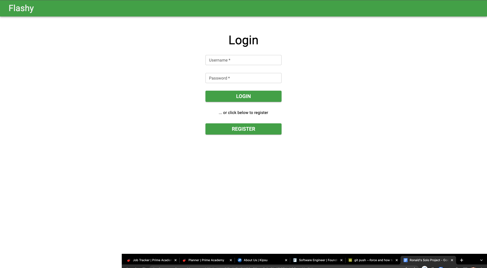
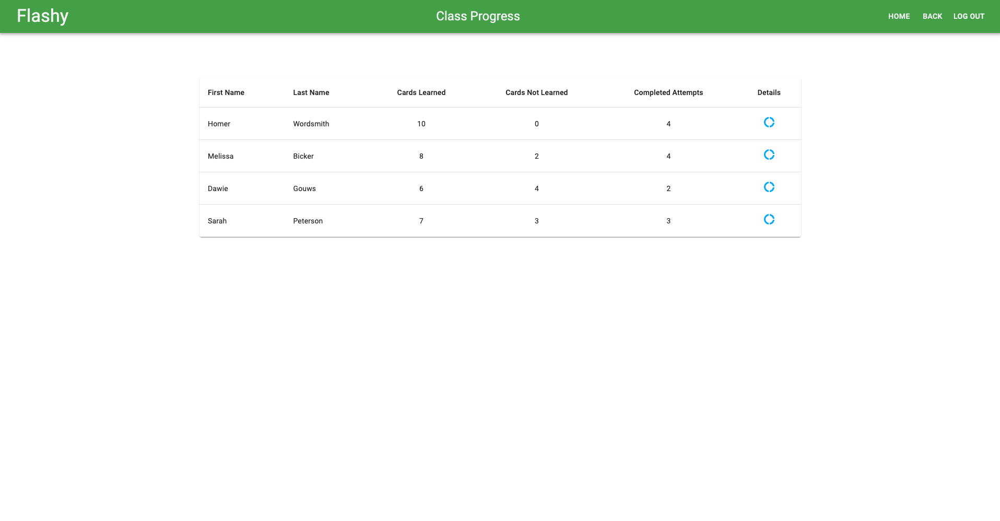

# Flashy: A teacher-focused flash card app

## Description

_Duration: Two Weeks Challenge_

Flashy is a teacher-focused flash card app intended for language study. Teachers assign stacks of flash cards to students and are then able to track each student’s progress and participation rate. Teachers can upload CSV files of cards (with front, back, and optionally a batch number in the CSV file) instead of typing out all the cards in the app. (Although that is an option too, along with editing any cards that were already created). The app makes use of Unicode and supports right-to-left text, so languages like Hebrew will display correctly on the digital cards.

Students receive feedback on their progress and reminders when they need to review cards. Cards get sorted based on the student’s familiarity with each card; once cards are marked “known” they will be reviewed periodically, but at intervals increasing in length. (For instance, cards get reviewed after 1 day, then 3 days, then 7 days, etc.).

Teachers are expected to interact with this application on desktop, while students are mostly expected to interact with the application on mobile.

A deployed version of the app can be found [here](https://shrouded-bayou-74485.herokuapp.com/).

The scope document for this project, in Google Docs format, is available [here](https://docs.google.com/document/d/1qhgVAW9iBsIN5H6W28pClkwe0-kvPkaiO67Ugk0Gow4/edit?usp=sharing).

The app uses a [PostgreSQL](https://www.postgresql.org/) database to on the back end, [Express](https://expressjs.com/) / [Node.js](https://nodejs.org/en/) as a server, and [React](https://reactjs.org/), [Redux](https://redux.js.org/), and [Redux-Saga](https://redux-saga.js.org/) on the front end. Styling is provided by [Material-UI](https://mui.com/).

## Pedagogical notes

At the core of this app is a [spaced repetition flash card management system (based on the Leitner system)](https://en.wikipedia.org/wiki/Flashcard#Spaced_repetition) that can also be utilized using real cards. The app tracks these cards for the student, significantly reducing the management load and barrier to entry. The following introduction provides a visual representation and explanation of how this management process functions.

The student has a stack of cards, each containing a front (containing, e.g., a word) and back (containing a translation of the given word) and several boxes (or piles) labeled “not learned, seen, short term, review in 1 day, review in 3 days, review in n days.” At the start, all of the cards are in the “not learned” box:

The student then proceeds to review several cards by looking at the back and the front. The student places those cards in a “seen” pile:

Immediately after, the student reviews all of those cards, deciding whether they are “known” or not. Cards that are known are moved to the “short term” box, while cards that are not known are moved to the short term box. After this, the student starts the process of reviewing not learned cards again and then reviewing them and placing them in either the “not learned” box or the “short term” box, until a set amount of time has elapsed:

Once a set amount of time has elapsed (the end of the session), the student does a final review of all the cards in the “short term” box. Again, the student decides whether the cards are known or not; if known, they are moved to the “review in 1 day” box, otherwise they are placed back in the “not learned” box:

After one day, the student first reviews the cards in the “review in 1 day” box. The process remains the same; known words move to the “review in 3 days” box, while unknown cards are placed back in the “not learned” box:

After reviewing any older cards that need to be reviewed from the “review in x days” boxes, the student repeats the whole process with words in the “not learned” box for a set amount of time. Words that are reviewed in the “review in 3 days” (and spaced periods after that) either gets moved to the next box or placed in the “not learned” box.

## Screenshots


_Login._


_Student Dashboard. Badges show how many cards should be learned and / or reviewed._


_Students view their stats before and after reviewing cards._


_Students first review any older cards that are due for review._


_Then students learn any new cards by viewing both sides of the card, until the timer runs out (or there are no new cards to review)._


_Students celebrate having finished each review session._


_Teacher Dashboard. Here teachers can manage and add classes and stacks of cards._


_Teachers can edit stacks of cards or upload cards via CSV._


_Teachers can edit classes by setting specific stacks, card batch release dates, and how long student sessions should be._


_Teachers can view the class progress._


_Teachers can also view the progress of individuals, including the number of sessions they have participated in._

## Installation

1. After cloning this repository, set up a PostgreSQL database called `flashy` on port 5432. You might want to use [Postico](https://eggerapps.at/postico/) as a GUI to help this setup process.
2. Use the commands in the `database.sql` file in the root directory of the project to set up tables in the database with some dummy data.
3. Run `npm install` to install dependencies in this project.
4. In the root directory of the project, set up a file called `.env` and in this file add only the following lines, where the text in quotation marks should appear without quotation marks, but be the desired server session secret:

```
SERVER_SESSION_SECRET="my_super_secret_text"
```

5. Run `npm server start` to start the server, which will run on port 5000.
6. Run `npm client start` to start the client, which will run on port 3000.
7. Running the client should open up a browser window to `localhost:3000` where you can view and use the app. You can also manually type in this address in your browser.

## Prerequisites

Before you get started, make sure you have the following software installed on your computer:

- [Node.js](https://nodejs.org/en/)
- [PostrgeSQL](https://www.postgresql.org/)
- [Nodemon](https://nodemon.io/)

## Built With

1. [Node.js](https://nodejs.org/en/)
2. [Express](https://expressjs.com/)
3. [React](https://reactjs.org/)
4. [Redux](https://redux.js.org/)
5. [Redux-Saga](https://redux-saga.js.org/)
6. [PostgreSQL](https://www.postgresql.org/)
7. [Material-UI](https://mui.com/)
8. [axios](https://www.npmjs.com/package/axios)
9. [react-papaparse](https://www.npmjs.com/package/react-papaparse)
10. [react-confetti](https://www.npmjs.com/package/react-confetti)
11. [node-cron](https://www.npmjs.com/package/node-cron)
12. [dotenv](https://www.npmjs.com/package/dotenv)
13. HTML
14. CSS

## Acknowledgement

Thanks to [Prime Digital Academy](www.primeacademy.io) who equipped and helped me to make this application a reality. Special thanks to my instructors, Dane Smith and Liz Kerber, and the Solinas cohort—thanks for the cameraderie, the technical discussions, and the caring way in which you helped guide this project to fruition.
